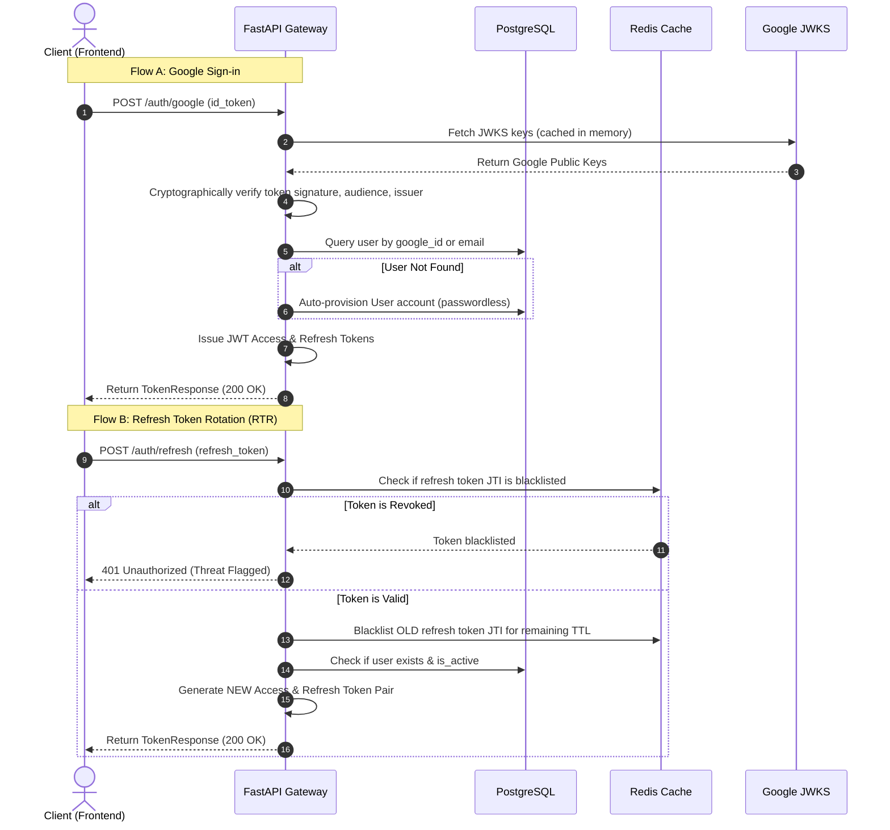

# Authentication & Google Sign-In Architecture

This document describes the design, implementation, and security flow of the authentication system in Helix Finance AI. It supports both traditional credentials (email/password) and Google Sign-In (Gmail).

---

## 1. Architectural Overview

The authentication system is built with a defense-in-depth approach, combining robust cryptographic signatures, real-time revocation lists, and strict database verification.



---

## 2. Key Components Used

| Component | Technology | Role / Purpose |
| :--- | :--- | :--- |
| **Identity Provider (IdP)** | Google OAuth 2.0 | Enables passwordless Google Gmail authentication using OpenID Connect (OIDC) ID Tokens. |
| **API Gateway / Server** | FastAPI | Provides type-safe validation, Swagger documentation, and high-performance async route handling. |
| **ORM / Database** | SQLAlchemy 2.0 & PostgreSQL | Persists user profile information, roles, status, and OAuth linkages. |
| **Blacklist Store** | Redis | Implements temporary storage for revoked token IDs (`jti`) to enforce logout and prevent refresh token reuse. |
| **Token Standards** | JSON Web Tokens (JWT) | Provides stateless authentication payload signed via python-jose (HS256 in dev/test). |
| **Password Security** | bcrypt (passlib) | Hashes local passwords with high-entropy salt before database storage. |

---

## 3. Database Schema

The users table stores core attributes and linkages for Google integration:

```python
class User(Base):
    __tablename__ = "users"

    id: Mapped[uuid.UUID] = mapped_column(UUID(as_uuid=True), primary_key=True, default=uuid.uuid4)
    email: Mapped[str] = mapped_column(String(255), unique=True, index=True, nullable=False)
    hashed_password: Mapped[str | None] = mapped_column(String(255), nullable=True) # Nullable for Google-only users
    first_name: Mapped[str | None] = mapped_column(String(100), nullable=True)
    last_name: Mapped[str | None] = mapped_column(String(100), nullable=True)
    is_active: Mapped[bool] = mapped_column(Boolean, default=True, nullable=False)
    google_id: Mapped[str | None] = mapped_column(String(255), unique=True, index=True, nullable=True)
    roles: Mapped[List[str]] = mapped_column(JSONB, default=list, nullable=False)
    created_at: Mapped[datetime] = mapped_column(DateTime(timezone=True), default=utc_now)
    updated_at: Mapped[datetime] = mapped_column(DateTime(timezone=True), default=utc_now, onupdate=utc_now)
```

---

## 4. Detailed Security Features

### A. Refresh Token Rotation (RTR)
To mitigate the risk of refresh tokens being stolen from client storage:
- Every time a refresh token is exchanged, a **new** access token and a **new** refresh token are issued.
- The **old** refresh token's unique ID (`jti`) is immediately blacklisted in Redis for its remaining TTL (time-to-live).
- If a client attempts to reuse a blacklisted refresh token, the API detects it immediately as a potential compromise and rejects the request.

### B. Google ID Token Cryptographic Verification
Instead of using slow API endpoints to verify tokens, we use a secure local validation method:
1. Google publishes its public keys (certificates) at a JWKS URL.
2. We fetch and cache these keys in memory to minimize latency.
3. Using `python-jose`, we verify that the token was signed by Google, has not expired, was issued for our Google Client ID (audience check), and came from Google (issuer check).

> [!TIP]
> **Developer Mode Bypass:** If `GOOGLE_CLIENT_ID` is empty during local development, the system checks if `DEBUG` is active. If so, it logs a warning and allows parsing the token without signature checking to simplify local testing without needing active Google credentials. In staging and production environments, signature verification is strictly enforced.

### C. Revocation / Logout Mechanism
When a user logs out via `POST /auth/logout`, their current refresh token's `jti` is extracted and added to the Redis blacklist with a TTL equal to the token's remaining time. This ensures the refresh token cannot be used again.

---

## 5. How to Configure

Add the following environment variables to your `.env` file:

```env
# Google Client Credentials (get from Google Cloud Console)
GOOGLE_CLIENT_ID="your-google-client-id.apps.googleusercontent.com"
GOOGLE_CLIENT_SECRET="your-google-client-secret"

# JWT configuration
SECRET_KEY="your-high-entropy-production-secret-key"
ACCESS_TOKEN_EXPIRE_MINUTES=30
REFRESH_TOKEN_EXPIRE_DAYS=7
```
